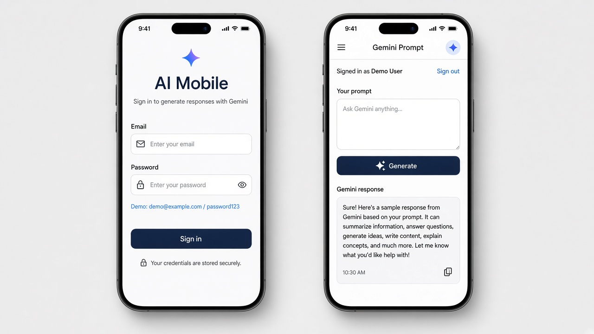
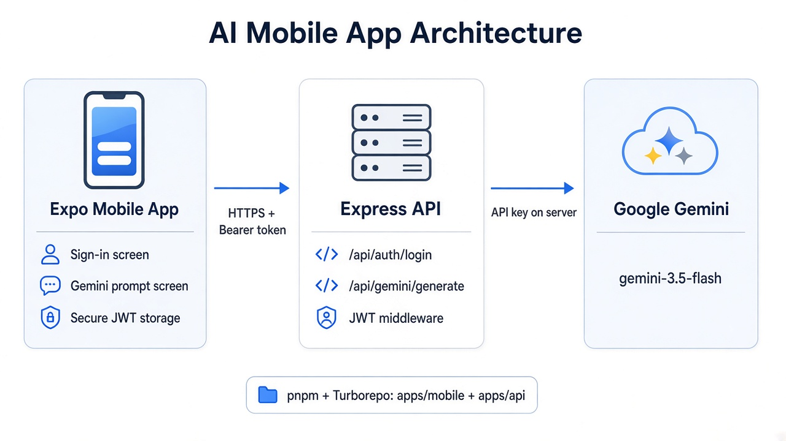
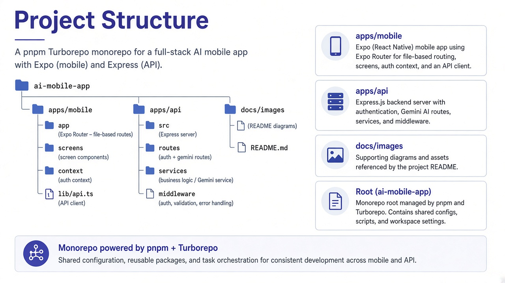
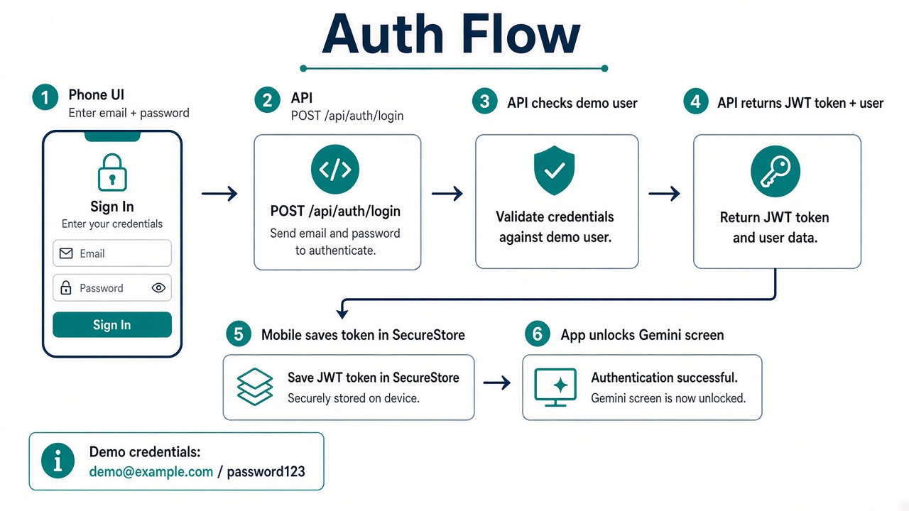
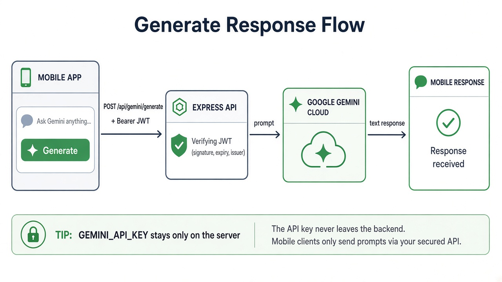

# AI Mobile App

An Expo + Express monorepo with **LLM integration** (Google Gemini). The mobile app signs in with JWT auth, then sends prompts to the LLM through a secure backend API. The Gemini API key never lives on the device.



## What this project does

1. User opens the Expo app and signs in.
2. The API checks demo credentials and returns a JWT.
3. The app stores the token securely and unlocks the prompt screen.
4. The user types a prompt and taps **Generate**.
5. The API verifies the JWT, calls the **integrated LLM (Gemini)** with the server-side API key, and returns the text.



## LLM integration (Google Gemini)

This project integrates a Large Language Model (LLM) on the **backend**, not inside the mobile app.

| Piece | Details |
| --- | --- |
| LLM provider | Google Gemini |
| SDK | `@google/genai` |
| Model | `gemini-3.5-flash` |
| Service file | `apps/api/src/services/gemini.service.ts` |
| API routes | `GET /api/gemini/test`, `POST /api/gemini/generate` |
| Auth required | Yes — JWT Bearer token |
| Secret | `GEMINI_API_KEY` in `apps/api/.env` only |

### Why the LLM is on the server

- Keeps `GEMINI_API_KEY` private (mobile apps can be reverse-engineered).
- Lets you add rate limits, logging, and prompt checks later in one place.
- Mobile only sends the user prompt + JWT; the API talks to Gemini.

### How the LLM call works in code

1. Mobile (`apps/mobile/src/lib/api.ts`) calls `generateRequest(token, prompt)`.
2. Express route `POST /api/gemini/generate` is protected by `requireAuth`.
3. Controller (`gemini.controller.ts`) reads `{ prompt }` from the body.
4. Service (`gemini.service.ts`) creates a `GoogleGenAI` client and runs:

```ts
const response = await ai.models.generateContent({
  model: "gemini-3.5-flash",
  contents: cleaned,
});
```

5. The returned text is sent back to the mobile app and shown on the Gemini prompt screen.

### Try the LLM quickly

After the API is running and you have a valid JWT:

```bash
# 1) Login
curl -X POST http://localhost:5000/api/auth/login \
  -H "Content-Type: application/json" \
  -d "{\"email\":\"demo@example.com\",\"password\":\"password123\"}"

# 2) Generate with the token from step 1
curl -X POST http://localhost:5000/api/gemini/generate \
  -H "Content-Type: application/json" \
  -H "Authorization: Bearer YOUR_JWT_HERE" \
  -d "{\"prompt\":\"Say hello in one short sentence\"}"
```

Or use the in-app **Generate** button after signing in.

## Tech stack

| Layer | Technology |
| --- | --- |
| Mobile | Expo SDK 57, Expo Router, React Native, Secure Store |
| API | Express 5, TypeScript, JWT (`jsonwebtoken`) |
| LLM | Google Gemini via `@google/genai` (`gemini-3.5-flash`) |
| Monorepo | pnpm workspaces + Turborepo |

## Project structure



```text
ai-mobile-app/
├── apps/
│   ├── mobile/                 # Expo app (UI + auth session)
│   │   ├── src/app/            # Screens (file-based routing)
│   │   │   ├── sign-in.tsx     # Login screen
│   │   │   └── (app)/index.tsx # Gemini prompt screen
│   │   ├── src/context/        # Session / auth provider
│   │   ├── src/lib/api.ts      # API client (login + generate)
│   │   └── .env                # EXPO_PUBLIC_API_URL
│   └── api/                    # Express backend
│       ├── src/server.ts       # App entry + routes
│       ├── src/routes/         # /api/auth, /api/gemini
│       ├── src/controllers/    # Request handlers
│       ├── src/services/       # Login + Gemini logic
│       ├── src/middleware/     # JWT auth guard
│       └── .env                # PORT, JWT_SECRET, GEMINI_API_KEY
├── docs/images/                # README diagrams
├── package.json                # Root scripts (turbo)
├── pnpm-workspace.yaml
└── turbo.json
```

### Important folders explained

- **`apps/mobile`** — The React Native / Expo client. Handles UI, navigation, and storing the JWT.
- **`apps/api`** — The backend. Owns auth, Gemini calls, and secrets.
- **`docs/images`** — Diagrams used in this README.
- **Root `package.json`** — Runs monorepo tasks with Turborepo (`pnpm dev`, `pnpm build`, etc.).

## Prerequisites

Install these before you start:

- [Node.js](https://nodejs.org/) (LTS recommended)
- [pnpm](https://pnpm.io/) (`npm install -g pnpm`)
- [Expo Go](https://expo.dev/go) on your phone (optional, for device testing)
- A [Google AI Studio](https://aistudio.google.com/apikey) Gemini API key

## Setup (step by step)

### 1. Install dependencies

From the repo root:

```bash
pnpm install
```

This installs packages for both `apps/mobile` and `apps/api`.

### 2. Configure the API environment

Create `apps/api/.env`:

```env
PORT=5000
JWT_SECRET=replace-with-a-long-random-secret
GEMINI_API_KEY=your-gemini-api-key
```

| Variable | Purpose |
| --- | --- |
| `PORT` | Port the Express server listens on (default `5000`) |
| `JWT_SECRET` | Secret used to sign and verify login tokens |
| `GEMINI_API_KEY` | Server-only Google Gemini key (never put this in the mobile app) |

### 3. Configure the mobile environment

Create `apps/mobile/.env`:

```env
EXPO_PUBLIC_API_URL=http://localhost:5000
```

| Variable | Purpose |
| --- | --- |
| `EXPO_PUBLIC_API_URL` | Base URL of the API the mobile app calls |

**Important for real devices / Expo tunnel:**

- `localhost` works for web / emulator on the same machine.
- On a physical phone, `localhost` points to the phone itself, not your PC.
- Use your computer’s LAN IP (example: `http://192.168.1.10:5000`) or a tunnel URL that reaches the API.

## How to run the project

Open **two terminals** (API + mobile).

### Terminal 1 — start the API

```bash
cd apps/api
pnpm dev
```

You should see something like:

```text
API running on http://localhost:5000
```

Quick health check:

```bash
curl http://localhost:5000/api/health
```

Expected response:

```json
{ "status": "ok" }
```

### Terminal 2 — start the mobile app

```bash
cd apps/mobile
pnpm start
```

Or with tunnel (useful for testing on a physical device):

```bash
cd apps/mobile
npx expo start --tunnel
```

Then open the app in:

- Expo Go (scan QR code)
- Android emulator
- iOS simulator
- Web (`w` in the Expo CLI)

You can also run both apps from the root with Turborepo:

```bash
pnpm dev
```

## Demo login

The API currently uses a single hard-coded demo user (no database yet):

| Field | Value |
| --- | --- |
| Email | `demo@example.com` |
| Password | `password123` |

These are prefilled on the sign-in screen for convenience.

## Auth flow (explained)



1. User enters email + password on `sign-in.tsx`.
2. Mobile calls `POST /api/auth/login`.
3. API validates against the demo user in `auth.service.ts`.
4. API signs a JWT (expires in 7 days) with `JWT_SECRET`.
5. Mobile saves the token + user in Secure Store via `SessionProvider`.
6. Expo Router unlocks the protected `(app)` screens.

Protected navigation is handled in `apps/mobile/src/app/_layout.tsx` with `Stack.Protected`.

## Generate / LLM flow (explained)



This is the end-to-end path for **LLM integration** in the app:

1. User types a prompt on the Gemini screen.
2. Mobile calls `POST /api/gemini/generate` with:
   - JSON body: `{ "prompt": "..." }`
   - Header: `Authorization: Bearer <jwt>`
3. API middleware (`requireAuth`) verifies the JWT.
4. `gemini.service.ts` calls the integrated LLM (Google Gemini) using `GEMINI_API_KEY`.
5. API returns `{ success: true, message: "<llm text>" }`.
6. Mobile shows the response. If the token is invalid (`401`), the app signs the user out.

## API reference

Base URL: `EXPO_PUBLIC_API_URL` (default `http://localhost:5000`)

### Public

| Method | Path | Description |
| --- | --- | --- |
| `GET` | `/` | Simple “API is running” message |
| `GET` | `/api/health` | Health check |
| `POST` | `/api/auth/login` | Login and receive JWT |

**Login body:**

```json
{
  "email": "demo@example.com",
  "password": "password123"
}
```

**Login success:**

```json
{
  "success": true,
  "token": "<jwt>",
  "user": {
    "id": "1",
    "email": "demo@example.com",
    "name": "Demo User"
  }
}
```

### Protected (requires `Authorization: Bearer <token>`)

| Method | Path | Description |
| --- | --- | --- |
| `GET` | `/api/auth/me` | Return the current user from the JWT |
| `GET` | `/api/gemini/test` | Smoke-test Gemini connection |
| `POST` | `/api/gemini/generate` | Generate text from a prompt |

**Generate body:**

```json
{
  "prompt": "Explain monorepos in one sentence"
}
```

## Mobile app map

| File | Role |
| --- | --- |
| `apps/mobile/src/app/_layout.tsx` | Root layout + protected routes |
| `apps/mobile/src/app/sign-in.tsx` | Login UI |
| `apps/mobile/src/app/(app)/index.tsx` | Prompt + response UI |
| `apps/mobile/src/context/auth-context.tsx` | Sign in / sign out / session state |
| `apps/mobile/src/lib/api.ts` | Shared fetch helper for API calls |
| `apps/mobile/src/lib/use-storage-state.ts` | Persists session with Secure Store |

## API app map

| File | Role |
| --- | --- |
| `apps/api/src/server.ts` | Express app, CORS, route mounting |
| `apps/api/src/routes/auth.routes.ts` | Auth endpoints |
| `apps/api/src/routes/gemini.routes.ts` | Gemini endpoints |
| `apps/api/src/middleware/auth.middleware.ts` | JWT guard |
| `apps/api/src/services/auth.service.ts` | Demo login + token verify |
| `apps/api/src/services/gemini.service.ts` | Gemini generate calls |

## Common issues

### “Cannot reach the API”

- Make sure `apps/api` is running.
- Check `EXPO_PUBLIC_API_URL` in `apps/mobile/.env`.
- On a real phone, do **not** use `localhost`. Use your PC LAN IP or a reachable tunnel.

### `401 Invalid email or password`

- Use exactly `demo@example.com` / `password123`.

### `503 GEMINI_API_KEY is not configured`

- Add `GEMINI_API_KEY` to `apps/api/.env` and restart the API.

### `503 JWT_SECRET is not configured`

- Add `JWT_SECRET` to `apps/api/.env` and restart the API.

### Expo QR / tunnel problems

- Restart Expo with `npx expo start --tunnel`.
- Confirm phone and computer are online.
- Rebuild the Expo connection after changing `.env` (restart Metro).

## Security notes

- Keep `.env` files local. They are ignored by git.
- Never put `GEMINI_API_KEY` or `JWT_SECRET` in the mobile app.
- The current login is demo-only. Replace it with a real user database before production.

## Scripts cheat sheet

From the **repo root**:

```bash
pnpm install      # install all workspace deps
pnpm dev          # run workspace "dev" tasks via Turbo
pnpm build        # build workspaces
pnpm typecheck    # typecheck workspaces
```

From **`apps/api`**:

```bash
pnpm dev          # start API with hot reload (tsx watch)
pnpm build        # compile TypeScript to dist/
pnpm start        # run compiled server
```

From **`apps/mobile`**:

```bash
pnpm start        # Expo dev server
pnpm android      # open Android
pnpm ios          # open iOS simulator
pnpm web          # open web
```

## Learn more

- [Expo docs (SDK 57)](https://docs.expo.dev/versions/v57.0.0/)
- [Expo Router](https://docs.expo.dev/router/introduction/)
- [Google Gen AI SDK](https://github.com/googleapis/js-genai)
- [Turborepo](https://turbo.build/repo/docs)
- [pnpm workspaces](https://pnpm.io/workspaces)
